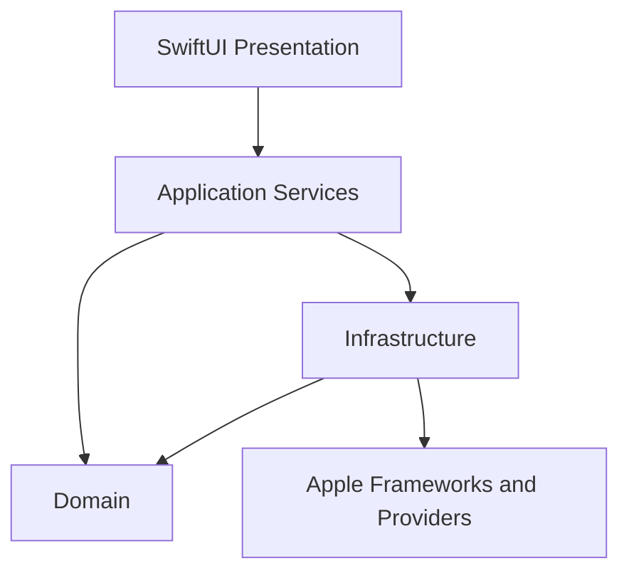

# Chapter 17 — Architecture Overview

## Decision
The application uses Presentation, Application, Domain, Infrastructure, and Platform layers. Dependencies point toward stable domain contracts.

The domain does not import SwiftUI, SwiftData, vendor SDKs, or rendering frameworks. Swift Concurrency is the default concurrency model. Shared mutable state is actor-isolated; UI state is main-actor isolated.

**Stable interfaces:** domain identities, repositories, provider contracts, canonical stream events, renderable blocks.

**Replaceable components:** storage engine, provider transports, renderers, speech engines, indexes, extractors.
