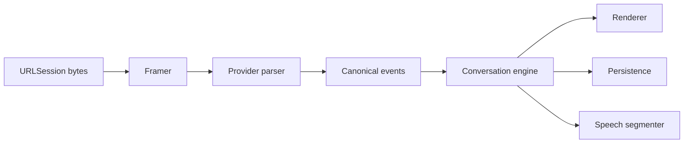

# Chapter 31 — Streaming Architecture

## Decision
Provider streams become `AsyncSequence` values of canonical events.

SSE parsing operates on bytes and line boundaries, tolerates split chunks, supports multi-line data, and never equates a network chunk with an event.

Events include response start, block start, text delta, metadata delta, block end, usage, finish reason, warning, and response end. Persistence batches deltas. Malformed streams preserve partial content and produce typed errors.

The current implementation covers response start, text delta, finish reason, and response end for OpenAI-compatible SSE. The byte framer tolerates split chunks, CRLF boundaries, multiline data, comments, and a final event without a trailing blank line.
