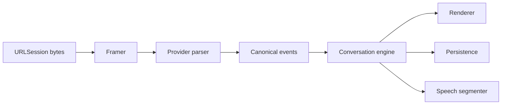

# Chapter 31 — Streaming Architecture

## Decision
Provider streams become `AsyncSequence` values of canonical events.

SSE parsing operates on bytes and line boundaries, tolerates split chunks, supports multi-line data, and never equates a network chunk with an event.

Events include response start, block start, text delta, metadata delta, tool-call delta, block end, usage, finish reason, warning, and response end. Persistence batches deltas. Malformed streams preserve partial content and produce typed errors. Tool-call streams pause the generation loop while an approved or explicitly safe tool executes, then resume with the tool result.

The current implementation covers response start, text delta, continuation metadata, tool-call deltas, finish reason, and response end for OpenAI-compatible SSE, with continuation metadata also supported by the Anthropic-compatible parser. The byte framer tolerates split chunks, CRLF boundaries, multiline data, comments, and a final event without a trailing blank line.
